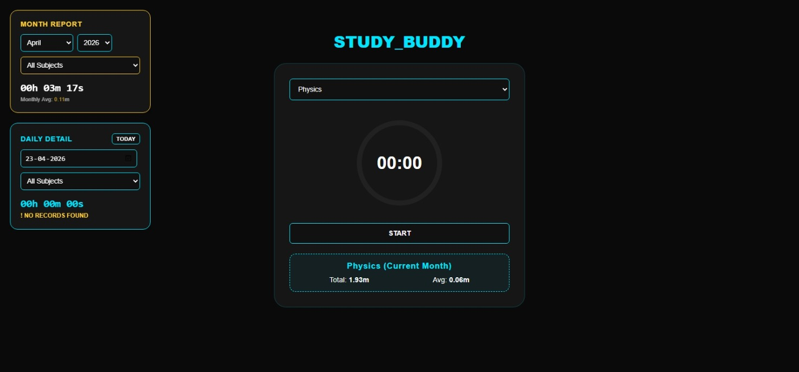

# StudyBuddy - Advanced Exam Prep Tracker

StudyBuddy is a professional-grade Node.js web application designed for students to track study sessions with extreme precision. It features real-time stopwatch functionality, API-verified time synchronization, and a robust multi-month CSV-based reporting system.

## 🚀 Features

* **Verified Timing:** Dual-clock system that attempts to verify session timestamps using `timeapi.io` for high-integrity records.
* **Dual-Card Analytics:**
    * **Monthly Report:** View total time and daily averages for any selected month/year.
    * **Daily Detail:** Deep-dive into specific dates with a calendar picker and "Today" reset button.
* **Intelligent Filtering:** Track "All Subjects" or filter specifically by Physics, Mathematics, Coding, or Chemistry.
* **Responsive Grid Layout:** Professional CSS Grid layout that stays fixed on Desktop but shifts analytics below the timer on Mobile devices.
* **Session Recovery:** LocalStorage-based backup prevents data loss if the browser is accidentally closed.
* **Local CSV Storage:** Data is stored in human-readable `.csv` files inside the `/records` directory.

## 📸 Dashboard Preview


*The StudyBuddy professional interface featuring the dark-mode aesthetic and real-time analytics.*

## 🛠️ Tech Stack

* **Backend:** Node.js, Express.js
* **Frontend:** HTML5, CSS3 (Grid & Flexbox), JavaScript (ES6+)
* **Animations:** GSAP (GreenSock Animation Platform)
* **Data Storage:** CSV (Local File System)

## 📋 Installation

1.  **Prerequisites:**
    Ensure you have [Node.js](https://nodejs.org/) installed.

2.  **Project Setup:**
    Navigate to your project folder:
    ```bash
    cd C:\Users\Rowdy\Desktop\StudyBuddy
    ```

3.  **Install Dependencies:**
    ```bash
    npm install express axios
    ```

## 🚦 How to Run

1.  **Using the Batch File (Recommended):**
    Double-click `Start_StudyBuddy.bat` on your desktop. This will:
    * Start the Node.js server.
    * Automatically open `http://localhost:3000` in your default browser.

2.  **Manual Start:**
    ```bash
    node app.js
    ```

## 📂 Project Structure

```text
StudyBuddy/
├── records/             # Monthly CSV log files
├── public/
│   ├── index.html       # Main UI & Logic
│   └── style.css        # Responsive Grid Styles
├── app.js               # Express Server & Analytics API
├── README.md            # Project Documentation
└── Start_StudyBuddy.bat # Quick-start Launcher
